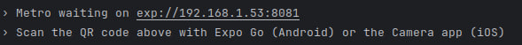
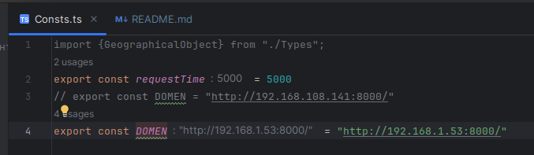
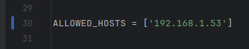
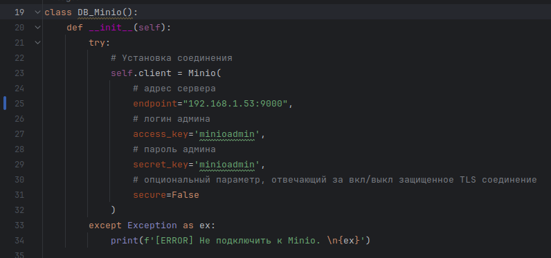

## Разработка Интернет Приложений

### Предметная область "Станции на поверхности Марса"

<details style="font-size: 14px;">
<summary>
<span style="font-size: 16px; font-weight: bold;">Описание лабораторной работы</span>
</summary>

- **Цель работы**: Создание нативного приложения
- **Порядок показа**: Кроме `Tauri` показывать на телефоне, отредактировать услуги в БД и продемонстрировать изменение в нативном приложении
- **Контрольные вопросы**: виды нативных приложений и отличие от web-приложений, react-native, pwa, tauri
- **Задание**: Создание приложения для `гостя` на iOS/Android/Tauri/Qt/React-native и подключением к веб-сервису

Создание простого нативного приложения для интерфейса гостя (без авторизации и редактирования), состоящий из 2 страниц с фильтрацией и картинками. Подключить приложение к разработанному API через IP адрес в локальной сети.

* [Методические указания Tauri](/tutorials/tauri/)
* [Методические указания React Native + Redux Toolkit](/tutorials/react-native/react_native.md)
* [Методические указания iOS (UI kit)](https://github.com/iu5git/web-2022/blob/main/tutorials/ios_tutorial/ios_tutorial.md)
* [Методические указания iOS (Swift UI)](/tutorials/swiftui)
* [Методические указания Android (Java)](https://github.com/iu5git/web-2022/blob/main/tutorials/android_tutorial/android_tutorial.md)
* [Методические указания Android (Kotlin + Compose)](/tutorials/lab7-android-kotlin/README.md)

</details>

<details style="font-size: 14px;">
<summary>
<span style="font-size: 16px; font-weight: bold;">Инструкция по подключению и отображению нативного приложения на мобильных устройствах</span>
</summary>

1. Установить `Expo Go` на мобильном устройстве

2. После сборки и запуска данного проекта нужно скорпировать `localhost` и `port`.



- Пусть, у нас получится `192.168.1.53.8081`, тогда:

3. В файле `Const.ts` заменить



4. Клонировать репозиторий [`Backend`](https://github.com/RedAlexDad/MarsStationBackend/tree/REST_API) у себя, переключить на ветку `REST_API`, затем в `setting.py` нужно установить значение как 



5. И в файле `DB_Minio` в `Backend` тоже установить как



6. Затем необходимо запустить `Backend` следующим образом:

```bash
python manage.py runserver 192.168.1.53.8000 
```

7. В мобильном устройстве по `QR-коду` навести камеру и запустить приложение.
</details>